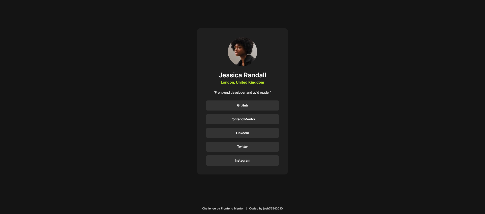

# Frontend Mentor - Social links profile solution

This is a solution to the [Social links profile challenge on Frontend Mentor](https://www.frontendmentor.io/challenges/social-links-profile-UG32l9m6dQ). Frontend Mentor challenges help you improve your coding skills by building realistic projects.

## Table of contents

- [Overview](#overview)
  - [The challenge](#the-challenge)
  - [Screenshot](#screenshot)
  - [Links](#links)
- [My process](#my-process)
  - [Built with](#built-with)
  - [What I learned](#what-i-learned)
- [Author](#author)

## Overview

### The challenge

Users should be able to:

- See hover and focus states for all interactive elements on the page

### Screenshot



### Links

- Solution URL: [https://www.frontendmentor.io/solutions/social-links-profile-h_lE60EjwI](https://www.frontendmentor.io/solutions/social-links-profile-h_lE60EjwI)
- Live Site URL: [https://josh76543210-fm-social-links-profile.netlify.app/](https://josh76543210-fm-social-links-profile.netlify.app/)

## My process

### Built with

- [Vite](https://vite.dev/) - frontend build tool
- [React](https://react.dev/) - JS library

### What I learned

Using a component layout in which the component props can easily be changed at one location to make it easy to add custom data.

```jsx
<ProfileCard
  name="Jessica Randall"
  location="London, United Kingdom"
  description="Front-end developer and avid reader."
>
  <ProfileLink text="GitHub" link="https://github.com/" />
  <ProfileLink text="Frontend Mentor" link="https://www.frontendmentor.io/" />
  <ProfileLink text="LinkedIn" link="https://www.linkedin.com/" />
  <ProfileLink text="Twitter" link="https://x.com/" />
  <ProfileLink text="Instagram" link="https://www.instagram.com/" />
</ProfileCard>
```

## Author

- GitHub - [@josh76543210](https://github.com/josh76543210)
- Frontend Mentor - [@josh76543210](https://www.frontendmentor.io/profile/josh76543210)
